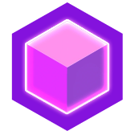

# AreonWorld - crafting your virtual reality

### Project Description

AreonWorld is an ambitious project dedicated to developing a decentralized application (dApp) on Areon Network. This groundbreaking platform seamlessly integrates metaverse elements with gamification, providing users with a canvas to express their creativity through the construction and exploration of virtual worlds. The primary objective of this initiative is to establish an engaging dApp within the Areon ecosystem, introducing gamification features to enhance user experience.

### Key features include:
- **World purchase:** Users can purchase virtual worlds within the platform, and with each world purchase, they receive two complimentary block colors for personalized customization.
- **Buying block colors:** Unlock additional creative possibilities by purchasing additional block colors, allowing users to bring a variety of aesthetics to their creations.
- **Building mode:** Upon world acquisition, users gain access to Building Mode, granting them the power to shape their virtual realms by placing and arranging blocks according to their imaginative vision.
- **Save world state:** Preserve the progress of your virtual creation by saving the world state, ensuring continuity for future interactions and explorations.
- **Explore others worlds:** Dive into the metaverse by exploring the virtual landscapes crafted by other platform users, sparking endless opportunities for adventure and discovery.

#### Key commands:
<table>
  <tr>
    <td>W, A, S, D</td>
    <td>Move around</td>
  </tr>
  <tr>
    <td>SPACE</td>
    <td>Jump</td>
  </tr>
  <tr>
    <td>1 - 9</td>
    <td>Select block color</td>
  </tr>
  <tr>
    <td>Left mouse click</td>
    <td>Place block</td>
  </tr>
  <tr>
    <td>Right mouse click</td>
    <td>Remove block</td>
  </tr>
</table>

#### Users will be able to build and explore the world in 3 modes:
- First person control;
- Free camera control;
- Building mode;

### dApp flow / actions:
1. Connect wallet;
2. Get some test AREA from faucet;
3. Buy worlds (1 world = 0.05 AREA [testnet]) ** . You will get 2 free colors;
4. Buy additional block colors (1 block color = 0.01 AREA [testnet]) **;
5. Open your world and add blocks;
6. Save the world state;
7. You can also open and explore worlds of other users.

** - These prices may be different in the final version of the project

### Project Milestones:
- Launch the project on Areon Mainnet;
- Integrate the ability for users to acquire textures for blocks, enhancing the creative palette available for world customization;
- Establish a sustainable community engagement strategy by allocating a percentage of all funds generated from world and block color purchases to organize weekly and monthly lotteries/draws, offering exciting rewards for users;
- Develop a comprehensive in-game marketplace featuring a diverse range of items and world decorations, providing users with the opportunity to further enhance their virtual environments;
- Implement engaging seasonal campaigns and events, featuring custom prebuilt maps that users can explore.
